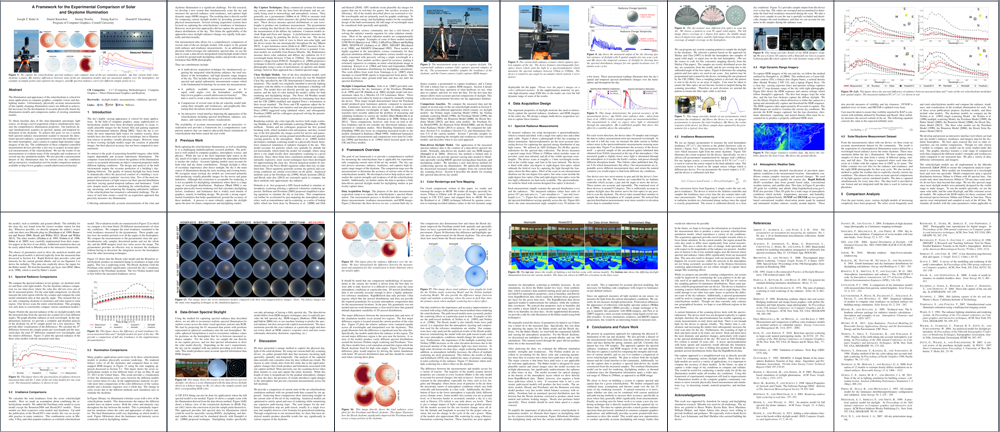

# Sky Measurements

This repository is the data from the follow work:

ACM TOG 33(6) - Proceedings of ACM SIGGRAPH ASIA (**2014**) 
**A Framework for the Experimental Comparison of Solar and Skydome Illumination** 
[Joseph T. Kider Jr.](http://www.josephkider.com/), [Daniel T. Knowlton](http://www.danknowlton.com/), [Jeremy Newlin](http://www.jeremynewlin.info/), [Yining Karl Li](https://www.yiningkarlli.com/), and [Donald P. Greenberg](http://www.graphics.cornell.edu/people/director.html)

### Abstract
---
The illumination and appearance of the solar/skydome is critical for many applications in computer graphics, computer vision, and daylighting studies. Unfortunately, physically accurate measurements of this rapidly changing illumination source are difficult to achieve, but necessary for the development of accurate physically-based sky illumination models and comparison studies of existing simulation models.

To obtain baseline data of this time-dependent anisotropic light source, we design a novel acquisition setup to simultaneously measure the comprehensive illumination properties. Our hardware design simultaneously acquires its spectral, spatial, and temporal information of the skydome. To achieve this goal, we use a custom built spectral radiance measurement scanner to measure the directional spectral radiance, a pyranometer to measure the irradiance of the entire hemisphere, and a camera to capture high-dynamic range imagery of the sky. The combination of these computer-controlled measurement devices provides a fast way to acquire accurate physical measurements of the solar/skydome. We use the results of our measurements to evaluate many of the strengths and weaknesses of several sun-sky simulation models. We also provide a measurement dataset of sky illumination data for various clear sky conditions and an interactive visualization tool for model comparison analysis available online.

### Data
---

All data was captured on the roof of [Rhodes Hall](https://www.fs.cornell.edu/fs/facinfo/fs_facilinfo.cfm?facil_cd=2051) at [Cornell University](https://www.cornell.edu/). 
latitude : 42.443449  
longitude : -76.481962

| Capture Time | Spectral Data | HDR Imagery | Pyranometer | Rapid Refresh (3D grid) | Ground Stations
| ------------- | ------------- | ------------- | ------------- | ------------- | ------------- |
| **2013_05-27__09-30** | [Radiance Files](data/2013-05-27/RADIANCE/2013-05-27___09.30.00.7z)  | [HDR Data](data/2013-05-27/HDR/2013_05-27__09-30-48.7z)  | [Irradiance](data/2013-05-27/IRRADIANCE/2013.05.27.09.30.00.txt)  | [3D Grid Data](data/2013-05-27/RR/RR_CONUS_13km_20130527_1300.grib2)  | [Station Data](data/2013-05-27/GROUNDSTATIONS/20130527_0000.7z)  |
| **2013_05-27__09-45** | [Radiance Files](data/2013-05-27/RADIANCE/2013-05-27___09.45.00.7z)  | [HDR Data](data/2013-05-27/HDR/2013_05-27__09-45-48.7z)  | [Irradiance](data/2013-05-27/IRRADIANCE/2013.05.27.09.45.00.txt)  | [3D Grid Data](data/2013-05-27/RR/RR_CONUS_13km_20130527_1300.grib2)  | [Station Data](data/2013-05-27/GROUNDSTATIONS/20130527_0000.7z)  |
| **2013_05-27__10-00** | [Radiance Files](data/2013-05-27/RADIANCE/2013-05-27___10.00.00.7z)  | [HDR Data](data/2013-05-27/HDR/2013_05-27__10-00-48.7z)  | [Irradiance](data/2013-05-27/IRRADIANCE/2013.05.27.10.00.00.txt)  | [3D Grid Data](data/2013-05-27/RR/RR_CONUS_13km_20130527_1400.grib2)  | [Station Data](data/2013-05-27/GROUNDSTATIONS/20130527_0000.7z)  |
| **2013_05-27__10-15** | [Radiance Files](data/2013-05-27/RADIANCE/2013-05-27___10.15.00.7z)  | [HDR Data](data/2013-05-27/HDR/2013_05-27__10-15-48.7z)  | [Irradiance](data/2013-05-27/IRRADIANCE/2013.05.27.10.15.00.txt)  | [3D Grid Data](data/2013-05-27/RR/RR_CONUS_13km_20130527_1400.grib2)  | [Station Data](data/2013-05-27/GROUNDSTATIONS/20130527_0000.7z)  |
| **2013_05-27__10-31** | [Radiance Files](data/2013-05-27/RADIANCE/2013-05-27___10.30.00.7z)  | [HDR Data](data/2013-05-27/HDR/2013_05-27__10-30-48.7z)  | [Irradiance](data/2013-05-27/IRRADIANCE/2013.05.27.10.30.00.txt)  | [3D Grid Data](data/2013-05-27/RR/RR_CONUS_13km_20130527_1400.grib2)  | [Station Data](data/2013-05-27/GROUNDSTATIONS/20130527_0000.7z)  |
| **2013_05-27__10-45** | [Radiance Files](data/2013-05-27/RADIANCE/2013-05-27___10.45.00.7z)  | [HDR Data](data/2013-05-27/HDR/2013_05-27__10-45-48.7z)  | [Irradiance](data/2013-05-27/IRRADIANCE/2013.05.27.10.45.00.txt)  | [3D Grid Data](data/2013-05-27/RR/RR_CONUS_13km_20130527_1400.grib2)  | [Station Data](data/2013-05-27/GROUNDSTATIONS/20130527_0000.7z)  |
| **2013_05-27__11-00** | [Radiance Files](data/2013-05-27/RADIANCE/2013-05-27___11.00.00.7z)  | [HDR Data](data/2013-05-27/HDR/2013_05-27__11-00-48.7z)  | [Irradiance](data/2013-05-27/IRRADIANCE/2013.05.27.11.00.00.txt)  | [3D Grid Data](data/2013-05-27/RR/RR_CONUS_13km_20130527_1500.grib2)  | [Station Data](data/2013-05-27/GROUNDSTATIONS/20130527_0000.7z)  |
| **2013_05-27__11-15** | [Radiance Files](data/2013-05-27/RADIANCE/2013-05-27___11.15.00.7z)  | [HDR Data](data/2013-05-27/HDR/2013_05-27__11-15-48.7z)  | [Irradiance](data/2013-05-27/IRRADIANCE/2013.05.27.11.15.00.txt)  | [3D Grid Data](data/2013-05-27/RR/RR_CONUS_13km_20130527_1500.grib2)  | [Station Data](data/2013-05-27/GROUNDSTATIONS/20130527_0000.7z)  |
| **2013_05-27__11-30** | [Radiance Files](data/2013-05-27/RADIANCE/2013-05-27___11.30.00.7z)  | [HDR Data](data/2013-05-27/HDR/2013_05-27__11-30-48.7z)  | [Irradiance](data/2013-05-27/IRRADIANCE/2013.05.27.11.30.00.txt)  | [3D Grid Data](data/2013-05-27/RR/RR_CONUS_13km_20130527_1500.grib2)  | [Station Data](data/2013-05-27/GROUNDSTATIONS/20130527_0000.7z)  |
| **2013_05-27__11-45** | [Radiance Files](data/2013-05-27/RADIANCE/2013-05-27___11.45.00.7z)  | [HDR Data](data/2013-05-27/HDR/2013_05-27__11-46-55.7z)  | [Irradiance](data/2013-05-27/IRRADIANCE/2013.05.27.11.45.00.txt)  | [3D Grid Data](data/2013-05-27/RR/RR_CONUS_13km_20130527_1500.grib2)  | [Station Data](data/2013-05-27/GROUNDSTATIONS/20130527_0000.7z) |
| **2013_05-27__12-00** | [Radiance Files](data/2013-05-27/RADIANCE/2013-05-27___12.00.00.7z)  | [HDR Data](data/2013-05-27/HDR/2013_05-27__12-00-49.7z)  | [Irradiance](data/2013-05-27/IRRADIANCE/2013.05.27.12.00.00.txt)  | [3D Grid Data](data/2013-05-27/RR/RR_CONUS_13km_20130527_1600.grib2)  | [Station Data](data/2013-05-27/GROUNDSTATIONS/20130527_0000.7z)  |
| **2013_05-27__12-15** | [Radiance Files](data/2013-05-27/RADIANCE/2013-05-27___12.15.00.7z)  | [HDR Data](data/2013-05-27/HDR/2013_05-27__12-15-48.7z)  | [Irradiance](data/2013-05-27/IRRADIANCE/2013.05.27.12.15.00.txt)  | [3D Grid Data](data/2013-05-27/RR/RR_CONUS_13km_20130527_1600.grib2)  | [Station Data](data/2013-05-27/GROUNDSTATIONS/20130527_0000.7z)  |
| **2013_05-27__12-30** | [Radiance Files](data/2013-05-27/RADIANCE/2013-05-27___12.30.00.7z)  | [HDR Data](data/2013-05-27/HDR/2013_05-27__12-30-48.7z)  | [Irradiance](data/2013-05-27/IRRADIANCE/2013.05.27.12.30.00.txt)  | [3D Grid Data](data/2013-05-27/RR/RR_CONUS_13km_20130527_1600.grib2)  | [Station Data](data/2013-05-27/GROUNDSTATIONS/20130527_0000.7z)  |
| **2013_05-27__12-45** | [Radiance Files](data/2013-05-27/RADIANCE/2013-05-27___12.45.00.7z)  | [HDR Data](data/2013-05-27/HDR/2013_05-27__12-45-49.7z)  | [Irradiance](data/2013-05-27/IRRADIANCE/2013.05.27.12.45.00.txt)  | [3D Grid Data](data/2013-05-27/RR/RR_CONUS_13km_20130527_1600.grib2)  | [Station Data](data/2013-05-27/GROUNDSTATIONS/20130527_0000.7z)  |
| **2013_05-27__13-00** | [Radiance Files](data/2013-05-27/RADIANCE/2013-05-27___13.30.00.7z)  | [HDR Data](data/2013-05-27/HDR/2013_05-27__13-00-48.7z)  | [Irradiance](data/2013-05-27/IRRADIANCE/2013.05.27.13.00.00.txt)  | [3D Grid Data](data/2013-05-27/RR/RR_CONUS_13km_20130527_1700.grib2)  | [Station Data](data/2013-05-27/GROUNDSTATIONS/20130527_0000.7z)  |
| **2013_09-24__07-50** | [Radiance Files](data/2013-09-24/RADIANCE/2013-09-24___07.50.00.7z)  | [HDR Data](data/2013-09-24/HDR/2013_09-24__07-50-49.7z)  | [Irradiance](data/2013-09-24/IRRADIANCE/2013.09.24.07.50.03.txt)  | [3D Grid Data](data/2013-09-24/RR/RR_CONUS_13km_20140924_1100.grib2)  | [Station Data](data/2013-09-24/GROUNDSTATIONS/20130924_0000.7z)  |
| **2013_09-24__13-10** | [Radiance Files](data/2013-09-24/RADIANCE/2013-09-24___13.10.00.7z)  | [HDR Data](data/2013-09-24/HDR/2013_09-24__13-10-49.7z)  | [Irradiance](data/2013-09-24/IRRADIANCE/2013.09.24.13.10.00.txt)  | [3D Grid Data](data/2013-09-24/RR/RR_CONUS_13km_20140924_1700.grib2)  | [Station Data](data/2013-09-24/GROUNDSTATIONS/20130924_0000.7z)  |
| **2013_09-24__13-20** | [Radiance Files](data/2013-09-24/RADIANCE/2013-09-24___13.20.00.7z)  | [HDR Data](data/2013-09-24/HDR/2013_09-24__13-20-49.7z)  | [Irradiance](data/2013-09-24/IRRADIANCE/2013.09.24.13.20.00.txt)  | [3D Grid Data](data/2013-09-24/RR/RR_CONUS_13km_20140924_1700.grib2)  | [Station Data](data/2013-09-24/GROUNDSTATIONS/20130924_0000.7z)  |
| **2013_09-24__13-30** | [Radiance Files](data/2013-09-24/RADIANCE/2013-09-24___13.30.00.7z)  | [HDR Data](data/2013-09-24/HDR/2013_09-24__13-30-49.7z)  | [Irradiance](data/2013-09-24/IRRADIANCE/2013.09.24.13.30.00.txt)  | [3D Grid Data](data/2013-09-24/RR/RR_CONUS_13km_20140924_1700.grib2)  | [Station Data](data/2013-09-24/GROUNDSTATIONS/20130924_0000.7z)  |
| **2013_09-24__13-40** | [Radiance Files](data/2013-09-24/RADIANCE/2013-09-24___13.40.00.7z)  | [HDR Data](data/2013-09-24/HDR/2013_09-24__13-40-49.7z)  | [Irradiance](data/2013-09-24/IRRADIANCE/2013.09.24.13.40.00.txt)  | [3D Grid Data](data/2013-09-24/RR/RR_CONUS_13km_20140924_1700.grib2)  | [Station Data](data/2013-09-24/GROUNDSTATIONS/20130924_0000.7z)  |